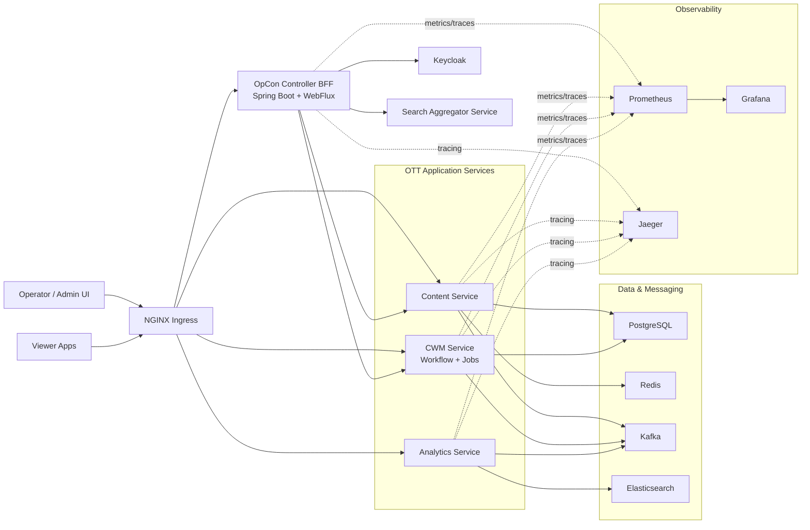

# OTT Platform Architecture

This diagram reflects the services and platform components currently present in this repository and Helm chart.

## Notes

- `OpCon Controller` is the BFF for operator-facing workflows, search, and content views.
- `Search Aggregator Service` is included because `opcon-controller` is configured to call it, even though its code is not currently present in this repository.
- `Keycloak` is shown as an external identity provider used by `OpCon Controller`.
- `Prometheus`, `Grafana`, `Jaeger`, `Redis`, and `Elasticsearch` come from the Helm chart dependencies and values.
